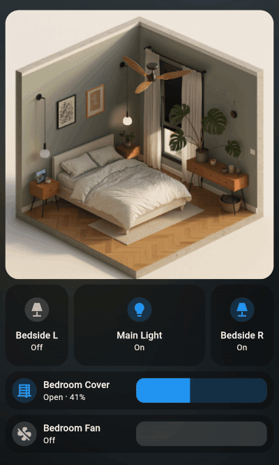

# 🎬 Home Assistant Animation Cards

> **Transform your Home Assistant dashboard with stunning animated visualizations**

[](https://www.home-assistant.io/)
[](https://en.wikipedia.org/wiki/WebM)
[](https://developer.mozilla.org/en-US/docs/Web/API/Canvas_API)
[](docs/ai-animation-guide.md)
[](LICENSE)

**Finally! Play videos and animations directly inside your Lovelace cards** 🚀

This repository provides custom Home Assistant cards that enable **smooth video playback and frame-by-frame animations** within your dashboard. No more static icons – bring your smart home to life with dynamic, responsive visualizations that react to your device states in real-time.

## 🤖 **AI-Generated Animation Tutorial Included!**

**📚 [Complete Step-by-Step AI Animation Guide](docs/ai-animation-guide.md)**

We've included a **comprehensive tutorial** showing you how to create the exact animations shown in our examples using **AI tools only** – no 3D software experience required! 

**✨ What you'll learn:**
- 🎨 Generate 3D models and animations using AI
- 🔄 Create smooth frame sequences automatically  
- 📹 Convert to WebM and PNG formats for Home Assistant
- ⚡ Optimize animations for perfect performance
- 🎯 Real examples: blinds, fans, and more

**⏱️ Time investment:** 20-30 minutes for your first professional animation

---

## ✨ Features

### 🎯 **Two Powerful Animation Cards**

#### **🎬 Frame-Based Animation Card (`ha-blinds-frame-card`)**
- **Jumps to specific frames** based on entity value
- **Perfect for position-based devices**: Blinds, covers, curtains, garage doors
- **Day/night transitions**: Lighting changes, weather effects
- **Smooth frame-to-frame transitions** with configurable easing

#### **🔄 Loop Animation Card (`ha-fan-loop-card`)**
- **Continuous loop animation** with variable speed control
- **Speed matches entity value**: Fan speed, pump rates, rotation speeds
- **Perfect for rotating devices**: Fans, ventilation, motors
- **Seamless looping** with dynamic speed adjustment

### 📱 **Universal Compatibility**
- **Desktop**: High-quality WebM video playback
- **Mobile**: Automatic PNG sequence fallback for optimal performance
- **Cross-platform**: Works on iOS, Android, and all modern browsers

### 🤖 **AI-Generated Animations**
- **No 3D software required!** Create professional animations using AI
- **Complete step-by-step guide** for generating custom animations
- **Blender-free workflow** – perfect for non-technical users

### 🎮 **Smart Entity Integration**
- **Real-time response** to Home Assistant entity state changes
- **Intelligent cooldown** system prevents animation spam
- **Customizable speed mapping** for variable-speed devices

---

## 🎥 Demo

🪟**Blinds Animation Card**

*Blinds automatically animate based on cover position*


🍃**Fan Animation Card**

*Fan speed dynamically matches entity speed percentage*


---

## 🚀 Quick Start

### 1. **Installation**
```bash
# Download the cards to your Home Assistant
wget -O /config/www/ha-blinds-frame-card.js https://raw.githubusercontent.com/your-repo/ha-animation-cards/main/ha-blinds-frame-card.js
wget -O /config/www/ha-fan-loop-card.js https://raw.githubusercontent.com/your-repo/ha-animation-cards/main/ha-fan-loop-card.js
```

### 2. **Add to Lovelace Resources**
```yaml
resources:
  - url: /local/ha-blinds-frame-card.js
    type: module
  - url: /local/ha-fan-loop-card.js  
    type: module
```

### 3. **Use in Picture Elements**
```yaml
type: picture-elements
image: /local/images/room-background.jpg
elements:
  # Frame-Based Animation - Blinds jump to specific frames
  - type: custom:ha-blinds-frame-card
    entity: cover.bedroom_blinds
    src: /local/animations/blinds.webm
    png_path: /local/animations/blinds_
    frames: 100
    fps: 25
    speed: 0.5
    style:
      left: 25%
      top: 30%
      width: 15%
      height: 40%
      
  # Loop Animation - Fan speed controls loop speed  
  - type: custom:ha-fan-loop-card
    entity: fan.ceiling_fan
    src: /local/animations/fan.webm
    png_path: /local/animations/fan_
    frames: 72
    fps: 60
    playMap:
      - [0, 0]     # 0% = stopped
      - [25, 0.5]  # 25% = half speed
      - [50, 1.0]  # 50% = normal speed
      - [75, 1.5]  # 75% = 1.5x speed
      - [100, 2.0] # 100% = double speed
    style:
      left: 50%
      top: 15%
      width: 10%
      height: 10%
```

---

## 🎨 Create Your Own Animations with AI

### **🚀 No 3D Software Experience Required!**

**📖 [Step-by-Step AI Animation Tutorial](docs/ai-animation-guide.md)**

We've created a **complete guide** that shows you exactly how to recreate the animations in our examples using **AI tools only**. Perfect for beginners who want professional results without learning complex 3D software.

**🎯 What's included in the tutorial:**
- 🤖 **AI Model Generation**: Create 3D models using text prompts
- 🎬 **Animation Creation**: Generate smooth frame sequences automatically
- 📹 **Format Conversion**: Convert to WebM and PNG for Home Assistant
- ⚡ **Performance Optimization**: Tips for smooth playback
- 📋 **Real Examples**: Step-by-step recreation of our sample animations

**✅ Complete examples provided:**
- 🪟 **Blinds Animation**: From fully open to fully closed
- 🌀 **Fan Animation**: Rotating blades with variable speed
- 🌅 **Day/Night Transition**: Lighting and color changes
- 🚪 **Garage Door**: Opening and closing sequences

**⏱️ Time investment:** 20-30 minutes for your first professional animation  
**💰 Cost:** Free AI tools + optional premium features  
**🎓 Prerequisites:** None! Complete beginner-friendly

---

## 🛠️ How It Works

### **🎬 Frame-Based Animation Card (`ha-blinds-frame-card`)**
**Perfect for position-based devices and state transitions:**

```typescript
// Maps entity value to specific video frame
Entity Value 0% → Frame 99 (fully open blinds)
Entity Value 50% → Frame 50 (half-open blinds)  
Entity Value 100% → Frame 0 (fully closed blinds)

// Smooth animated transition between frames
Current: 25% → Target: 75% = Animated jump between frames
```

**Ideal Use Cases:**
- 🪟 **Blinds & Covers**: Position-based animations
- 🌅 **Day/Night Cycles**: Lighting transitions, weather changes
- 🚪 **Garage Doors**: Open/close sequences
- 🌡️ **Temperature Visualization**: Color/state changes
- 💡 **Brightness Controls**: Dimming effects

**Key Features:**
- ⏱️ **Smart Cooldown**: Prevents animation spam during rapid changes
- 🎯 **Frame-Perfect**: Jumps to exact frame based on entity value
- 📐 **Configurable Easing**: Smooth acceleration/deceleration between frames
- 🔄 **Auto-Freeze**: Maintains final position after animation completes

### **🔄 Loop Animation Card (`ha-fan-loop-card`)**
**Ideal for continuous rotating/cycling devices:**

```typescript
// Continuous loop with variable speed based on entity value
Entity Value 0% → Stopped (frame 0)
Entity Value 25% → 0.5x loop speed
Entity Value 50% → 1.0x loop speed  
Entity Value 75% → 1.5x loop speed
Entity Value 100% → 2.0x loop speed

// Seamless looping animation when active
```

**Ideal Use Cases:**
- 🌀 **Fans**: Speed-responsive rotating animations
- 💨 **Ventilation Systems**: Air flow visualization
- 🔧 **Motors & Pumps**: Rotation speed indicators
- 🌊 **Water Features**: Flow rate animations
- ⚡ **Generators**: Running state with speed indication

**Key Features:**
- 🔄 **Seamless Looping**: Continuous animation cycles without breaks
- ⚡ **Variable Speed**: Animation speed dynamically matches device speed
- 🎛️ **Preset Support**: Works with fan preset modes (low/medium/high)
- 📱 **Mobile Optimized**: PNG sequences for smooth mobile performance

---

## 📖 Documentation

### **📚 [Complete Documentation](docs/README.md)**
- Detailed parameter reference
- Configuration examples
- Troubleshooting guide
- Performance optimization tips

### **🎬 [Animation Creation Guide](docs/ai-animation-guide.md)**
- Step-by-step AI animation tutorial
- File format conversion
- Optimization techniques
- Best practices

### **🏗️ [Integration Examples](docs/examples.md)**
- Real-world dashboard layouts
- Advanced styling techniques
- Multi-device scenarios
- Performance considerations

---

## 🎯 Use Cases

### **Frame-Based Animation Card - Perfect for:**
- 🪟 **Blinds & Covers**: Visual position feedback (0-100% open/closed)
- 🌅 **Day/Night Transitions**: Lighting changes, weather effects, sky colors
- 🚪 **Garage Doors**: Open/close sequences with position tracking
- 🌡️ **Temperature Visualization**: Color changes based on temperature ranges
- 💡 **Smart Lighting**: Brightness-based visual effects
- 🏠 **Room States**: Visual changes based on occupancy or modes
- 🔒 **Security Systems**: Armed/disarmed state transitions

### **Loop Animation Card - Perfect for:**
- 🌀 **Ceiling Fans**: Speed-responsive rotating animations
- 💨 **Ventilation Systems**: Air flow visualization with variable speed
- 🔧 **Motors & Pumps**: Rotation speed indicators
- 🌊 **Water Features**: Flow rate animations (fountains, pools)
- ⚡ **Generators**: Running state with RPM-based speed
- 🚗 **Garage Door Motors**: Operating state indication
- 🔄 **Any Rotating Equipment**: Speed-based visual feedback

### **Supported Entity Types:**
- 🪟 **Covers**: `cover.bedroom_blinds` (position-based)
- 🌀 **Fans**: `fan.ceiling_fan` (speed-based)  
- 💡 **Lights**: `light.room_lights` (brightness-based)
- 🌡️ **Sensors**: `sensor.temperature` (value-based)
- 🔧 **Custom Devices**: Any entity with numeric attributes

---

## 🚀 Advanced Features

### **Performance Optimization**
- **Lazy Loading**: PNG frames loaded on demand
- **Memory Management**: Efficient canvas-based rendering
- **Bandwidth Optimization**: Automatic format selection based on device
- **Caching**: Smart resource caching for smooth playback

### **Developer-Friendly**
- **TypeScript Support**: Full type definitions included
- **Extensible Architecture**: Easy to modify and extend
- **Debug Mode**: Built-in logging for troubleshooting
- **Custom Events**: Integration with other custom cards

---

## 🤝 Contributing

We welcome contributions! Whether you're:
- 🐛 **Reporting bugs**
- 💡 **Suggesting features**  
- 📝 **Improving documentation**
- 🎨 **Sharing animations**
- 💻 **Contributing code**

**[See Contributing Guidelines](CONTRIBUTING.md)**

---

## 📄 License

This project is licensed under the MIT License - see the [LICENSE](LICENSE) file for details.

---

## 🌟 Show Your Support

If this project helps you create amazing Home Assistant dashboards, please:
- ⭐ **Star this repository**
- 🔄 **Share with the community**
- 📸 **Post your creations** (tag us!)
- 🐛 **Report issues** to help us improve

---

## 🔗 Links

- 🏠 **[Home Assistant Community](https://community.home-assistant.io/)**
- 📱 **[Picture Elements Documentation](https://www.home-assistant.io/dashboards/picture-elements/)**
- 🎬 **[WebM Format Guide](https://developers.google.com/web/fundamentals/media/video)**
- 🤖 **[AI Animation Resources](docs/ai-resources.md)**

---

<div align="center">

**Made with ❤️ for the Home Assistant community**

*Transform your dashboard from static to spectacular!*

</div>